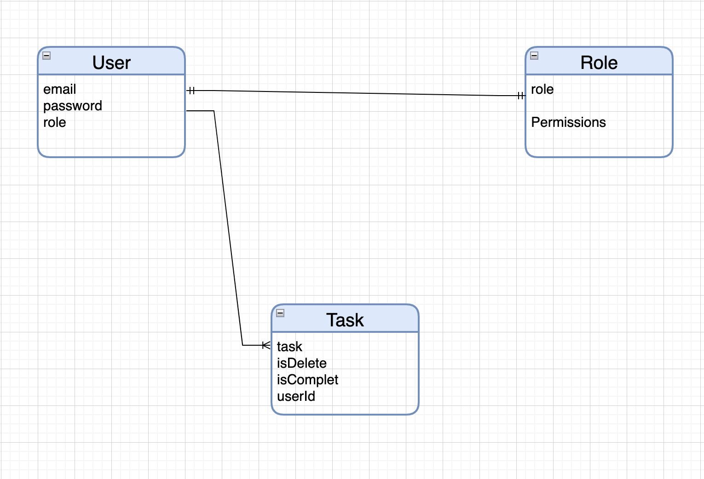
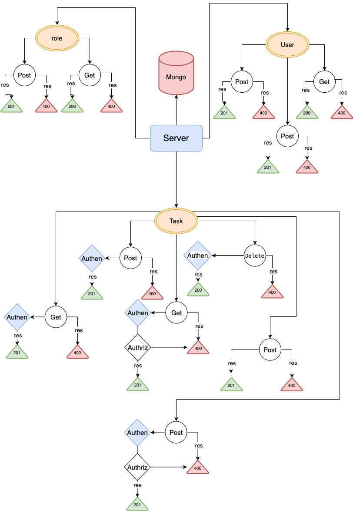

# w08d02
SignUp and Login With encrypt and gen Token
# Schemas:

## ROLE SCHEMA

```js
const mongoose = require("mongoose");
const role = new mongoose.Schema({
  role: { type: String, required: true },
  Permissions: { type: Array },
});
module.exports = mongoose.model("Role", role);


```

## USER SCHEMA

```js
const mongoose = require("mongoose");

const user = new mongoose.Schema({
  email: { type: String, required: true, unique: true },
  password: { type: String, required: true },
  role: { type: mongoose.Schema.Types.ObjectId, ref: "Role" },
});

module.exports = mongoose.model("User", user);


```


# SignUp:

## Controllers:

```js
const Register = async (req, res) => {
  const { email, password, role } = req.body;
  const lowerEmail = email.toLowerCase();
  const hashPass = await bcrypt.hash(password, SALT);
  const newUser = new userModel({
    email: lowerEmail,
    password: hashPass,
    role,
  });
  newUser
    .save()
    .then((result) => {
      res.status(201).json(result);
    })
    .catch((err) => {
      res.status(400).json(err);
    });
};
```
## Routes:

```js
userRouter.post("/signUp", Register);
```


# SignIn:

## Controllers:

```js
const login = (req, res) => {
  const { email, password } = req.body;

  userModel
    .findOne({ email })
    .then(async (result) => {
      if (result) {
          console.log(result);
        if (result.email == email) {
            const secret = process.env.SECRETKEY
            const hashedpass = await bcrypt.compare(password,result.password)
            console.log(hashedpass);
            console.log(secret);
            const payload ={
                role:result.role
            }
            option={
                expiresIn:"60m"
            }

            const token = await jwt.sign(payload ,secret,option)
            console.log(token);
          if (hashedpass) {
            res.status(200).json({result,token});
          } else {
            res.status(404).json("worng email or password");
          }
        } else {
          res.status(404).json("worng email or password");
        }
      } else {
        res.status(400).json("email does not exist");
      }
    })
    .catch((err) => {
      res.status(400).json(err);
    });
};

```
## Routes:

```js
userRouter.post("/login", login);

```

# ER-Diagram:




# UML-Diagram:



